<picture>
  <source media="(prefers-color-scheme: light)" srcset="assets/banner/hero-v2-light.svg">
  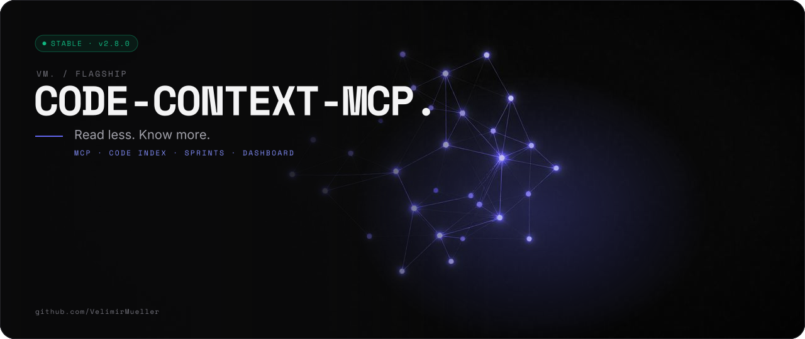
</picture>

<p align="center">

[](https://www.npmjs.com/package/vlm-code-context-mcp)  [](https://www.npmjs.com/package/vlm-code-context-mcp) [](LICENSE)

</p>

> Read less. Know more.

```text
 █████   ████   █████   ██████
██      ██  ██  ██  ██  ██
██      ██  ██  ██  ██  █████   █████
██      ██  ██  ██  ██  ██
 █████   ████   █████   ██████
 █████   ████   ██  ██  ██████  ██████  ██  ██  ██████
██      ██  ██  ███ ██    ██    ██       ████     ██
██      ██  ██  ██████    ██    █████     ██      ██    █████
██      ██  ██  ██ ███    ██    ██       ████     ██
 █████   ████   ██  ██    ██    ██████  ██  ██    ██
██   ██   █████  █████
███ ███  ██      ██  ██
███████  ██      █████
██ █ ██  ██      ██
██   ██   █████  ██      ██
```

An MCP server that gives AI coding agents a memory of your codebase and a sprint process.
Your agents forget everything between sessions. This one file does not.

<picture>
  <source media="(prefers-color-scheme: dark)" srcset="assets/readme/stats-v2-dark.svg">
  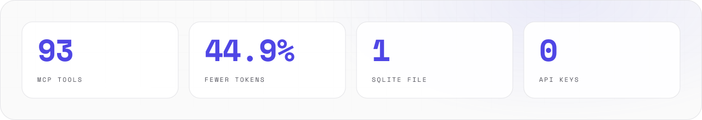
</picture>

<br>

## // 01 WHAT IT DOES


<picture>
  <source media="(prefers-color-scheme: dark)" srcset="assets/readme/features-v2-dark.svg">
  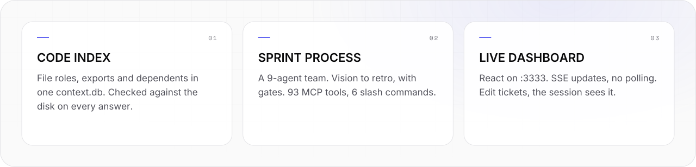
</picture>

- Gives AI coding agents **persistent memory**. The memory survives the session.
- Indexes your codebase into one SQLite file, `context.db`. Agents query file roles, exports and dependents. They do not read raw files first: about 45 % fewer tokens in the benchmark.
- Runs a full sprint process for a 9-agent team: vision, discovery, milestones, epics, tickets, gates and retros. It uses 93 MCP tools and 6 slash commands.
- Shows everything on a live React dashboard at `:3333`. Zero API keys.

<br>

## // 02 QUICK START

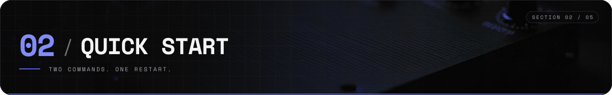

<picture>
  <source media="(prefers-color-scheme: dark)" srcset="assets/readme/start-v2-dark.svg">
  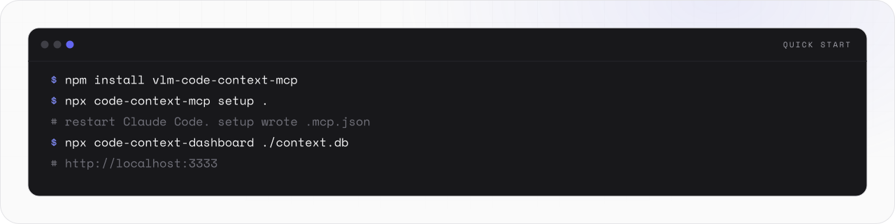
</picture>

```bash
npm install vlm-code-context-mcp
npx code-context-mcp setup .
npx code-context-dashboard ./context.db   # optional — live dashboard on :3333
```

Two commands, then restart Claude Code. Zero API keys. One `context.db` file.

1. **Install.** `npm install vlm-code-context-mcp`
2. **Initialize.** `npx code-context-mcp setup .`
   - Creates `context.db` and indexes your codebase.
   - Seeds a 9-agent team and the frontend skill library into the project database.
   - Writes `.mcp.json`. Offers to wire the sprint statusline into `.claude/settings.json`. Pass `--defaults` to skip the prompts.
   - Run it again later and it switches to **update mode**: migrate (with automatic backup) and config repair. It never touches your data.
   - `--force` renames the old database. It does not delete it.
3. **Restart your AI client.** Claude Code (or any MCP client) loads the server from `.mcp.json`. Verify with `get_project_status`.
   - Manual registration instead: `claude mcp add code-context -- node node_modules/vlm-code-context-mcp/dist/server/index.js ./context.db`
4. **Launch the dashboard.** `npx code-context-dashboard ./context.db`
   - Opens at `http://localhost:3333` with live SSE updates.
   - File watching and auto-reindex on save are on by default (derived from the indexed files).
   - Pass a directory as the 4th argument only to override it, for example on a database with nothing indexed yet:

     ```bash
     npx code-context-dashboard ./context.db 3333 .
     ```
5. **Run your first sprint.** Type `/kickoff` in Claude Code.

   ```
   /kickoff
   ```

   - The orchestrator walks you through vision → discovery → milestone → epics → tickets → sprint → implementation → retro.
   - It asks one question at a time. Smart resume lets you stop and continue later.

<br>

## // 03 HOW IT WORKS

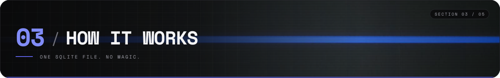

<picture>
  <source media="(prefers-color-scheme: dark)" srcset="assets/readme/flow-v2-dark.svg">
  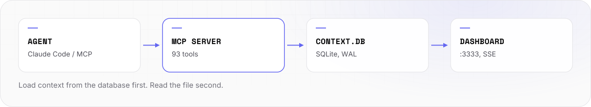
</picture>

Every command follows the same pattern: **load context from the database before doing anything.**

```
search_files("auth middleware")       → find the right file
get_file_context("src/auth.ts")      → understand role, exports, dependents
Read("src/auth.ts")                  → only now read the actual code
```

No agent holds the full project in its context window. Agents query a shared SQLite brain and write results back.

```text
┌─────────────────────────────────────────────────────┐
│               Claude Code / MCP Client              │
│  ┌──────────┐  ┌──────────┐  ┌──────────┐          │
│  │ /kickoff │  │ /sprint  │  │ /ticket  │  ...     │
│  └────┬─────┘  └────┬─────┘  └────┬─────┘          │
│       └──────────────┼─────────────┘                │
│                      ▼                              │
│     93 MCP Tools (99 with all toolsets)             │
│      (reads · writes · ceremony cards)              │
│                      │                              │
│                      ▼                              │
│  ┌─────────────────────────────────────┐            │
│  │       context.db (SQLite)           │            │
│  │  30 tables · WAL mode · <5ms reads  │            │
│  └──────────────────┬──────────────────┘            │
│                     │ WAL watcher                   │
│                     ▼                               │
│  ┌─────────────────────────────────────┐            │
│  │    React Dashboard (Vite)           │            │
│  │  62 components · SSE live updates   │            │
│  └─────────────────────────────────────┘            │
└─────────────────────────────────────────────────────┘
```

The full picture with the repo and the re-index loop: [docs/REFERENCE.md](docs/REFERENCE.md#architecture-the-full-picture).

<br>

## // 04 USAGE

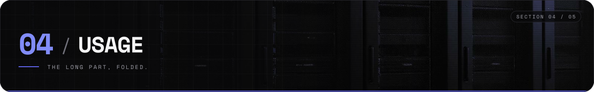

Long reference (skill sets, agent roles, sprint gates, release highlights): [docs/REFERENCE.md](docs/REFERENCE.md).

### Benchmark

<picture>
  <source media="(prefers-color-scheme: dark)" srcset="assets/readme/bench-v2-dark.svg">
  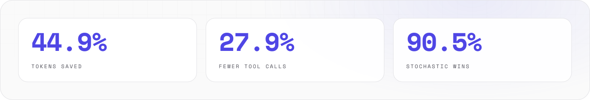
</picture>

- Simulated, not live sessions: 10 scripted development tasks (retrieval, debugging, refactoring, implementation), replayed against an 11-file fixture project.
- Token counts are estimated from what each approach reads. No model calls.
- Tokens (estimated): MCP 4,806, vanilla 8,726. Saved: **44.9 %**.
- Tool calls: MCP 49, vanilla 68. Saved: **27.9 %**.
- Stochastic run: 200 randomized trials, Wilcoxon signed-rank test. MCP wins **90.5 %** (p < 0.001). It is not a fluke.
- MCP tools return structured summaries (exports, deps, file role), not raw file content.
- Re-validated for v2.0.0. Since 2.0, sprint ceremonies cost **−39 % output tokens** with compact-by-default tools, measured on a replayed kickoff.
- Method and limits: [BENCHMARK-GUIDE.md](BENCHMARK-GUIDE.md).


<details>
<summary>Reproduce it yourself</summary>

```bash
# Deterministic — 10 tasks, 6 categories
npm test -- test/benchmark.test.ts

# Stochastic — 200 randomized trials, Wilcoxon test, bootstrap CI
npm test -- test/benchmark-stochastic.test.ts
```

Full methodology in [BENCHMARK-GUIDE.md](BENCHMARK-GUIDE.md).
</details>

### Dashboard

**7 pages. Live SSE updates. Zero polling.**


- **Dashboard:** kanban board, phase gate stepper, burndown, velocity, sprint checklist.
- **Planning:** milestone tracker, epic progress, discovery pipeline.
- **Code:** file tree, dependency graph, export/import map, change history.
- **Team:** agent cards, model badges, mood trends, workload bars.
- **Retro:** bento grid insights, cross-sprint patterns, recurring themes.
- **Benchmark:** MCP vs vanilla comparison with animated metrics.
- **Velocity:** sprint-by-sprint trends, committed vs completed.

Every database mutation triggers an instant refresh through SQLite WAL monitoring. Since 2.0 the board is **live-editable**: title, description, points, status and multi-agent assignments (with per-assignment models). Every edit raises a change flag. The Claude session sees it and acknowledges it at its next context load. The UI can never set DONE or `qa_verified`. Completion stays earned.

### Slash commands

Type these in Claude Code.

- `/kickoff`: full guided lifecycle, vision to retro. **Start here.**
- `/sprint`: sprint-only loop. Plan → implement → QA → retro → archive.
- `/ticket`: move tickets through their lifecycle with full context.
- `/milestone`: create, update, close milestones with epic verification.
- `/retro`: data-backed retrospectives with burndown and velocity analysis.
- `/sprint-connect`: bridge the dashboard UI to your Claude session.

`/kickoff` loads the frontend skill playbook into the session when a sprint has `fe-engineer` work. Pull the full guidance of any skill with `get_skill`.

### Skill sets (server-provided)

- Three libraries: **Frontend** (22 skills plus an editable house-style primer), **Landing pages** and **Workflow**.
- The MCP server serves them into your live session. They are not copied into your repo.
- Source: [`claude_development_skills`](https://github.com/VelimirMueller/claude_development_skills), vendored under `vendor/skills/`.
- Storage: the project DB `skills` table (`fe:*`, `la:*`, `wf:*`). Edit them. Re-seeds never overwrite your edits.
- Opt-in: `/kickoff` asks once. `update_skill_sets({ landing: true, ... })` changes it any time.
- Update: `CODE_CONTEXT_SKILLS_AUTOSYNC=1` syncs from the latest upstream release at boot. `npm run sync:skills` re-vendors the offline fallback.
- Details: [docs/REFERENCE.md](docs/REFERENCE.md#skill-sets-server-provided).

### The agent team

- 9 configurable agents: Product Owner, Team Lead, Architect, Backend Developer, Frontend Developer, Developer, QA Engineer, Security Engineer, DevOps.
- Dev roles default to `claude-fable-5`, QA to `claude-opus-5`, the rest to `claude-sonnet-5`.
- Change a model, tools or system prompt with the `update_agent` MCP tool or in the dashboard.
- The model **routes execution**: during `/kickoff` and `/sprint`, a subagent at the assigned model tier (`fable`/`opus`/`sonnet`/`haiku`) implements each ticket.
- Since 2.0, a ticket can have several agents. The lead implements, supporters verify, QA needs every verdict.
- Roles and focus: [docs/REFERENCE.md](docs/REFERENCE.md#the-agent-team).

### Sprint process

<picture>
  <source media="(prefers-color-scheme: dark)" srcset="assets/readme/phases-v2-dark.svg">
  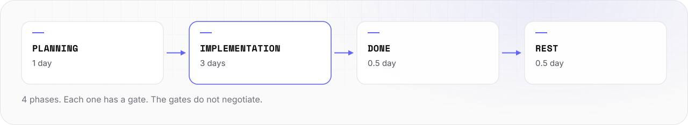
</picture>

```
planning → implementation → done → rest
```

- **Planning** (1 day): tickets assigned, velocity committed.
- **Implementation** (3 days): all tickets DONE or NOT_DONE, blockers resolved.
- **Done** (0.5 day): retro findings recorded, QA verified.
- **Rest** (0.5 day): automatic after retro.
- Change phases, durations and gates with `update_sprint_config`.
- Since 2.0, `start_sprint` and `advance_sprint` refuse while untriaged retro `try_next` findings or escalated discoveries exist. Override with `acknowledge_open_items: true`.
- Since 2.2, `qa_verified` needs commits with `Why:/What:/How:` body groups.

### Tech stack and engine numbers

- Runtime: Node.js 24 LTS. Build: TypeScript strict mode.
- Database: SQLite via better-sqlite3, WAL mode. 33 tables (27 scrum + 6 code).
- MCP protocol: @modelcontextprotocol/sdk. 93 MCP tools by default, 99 with `CODE_CONTEXT_TOOLSETS=all`.
- Dashboard: React 19 + Vite + Zustand + Framer Motion. CSS variables + Tailwind, dark theme. 75 React components.
- Live updates: SSE via WAL file watcher.
- Testing: Vitest. 762 tests (677 backend + 85 frontend).
- 9 agent roles (configurable). 4 sprint phases with gate checks + planning gate. 6 slash commands.
- 4 CLI bins: `code-context-mcp`, `code-context-dashboard`, `code-context-statusline`, `code-context-reindex`.

### Manual MCP server setup

If the automatic `.mcp.json` setup doesn't work:

```bash
# Add to current project
claude mcp add code-context npx -y vlm-code-context-mcp ./context.db

# Add globally
claude mcp add --scope user code-context node /path/to/node_modules/vlm-code-context-mcp/dist/server/index.js ./context.db

# Remove
claude mcp remove code-context
```

### Development

```bash
# MCP server
npm run dev

# Dashboard (Vite dev server with HMR)
npm run dashboard:dev
```

<br>

## // 05 STATUS


<picture>
  <source media="(prefers-color-scheme: dark)" srcset="assets/readme/status-v2-dark.svg">
  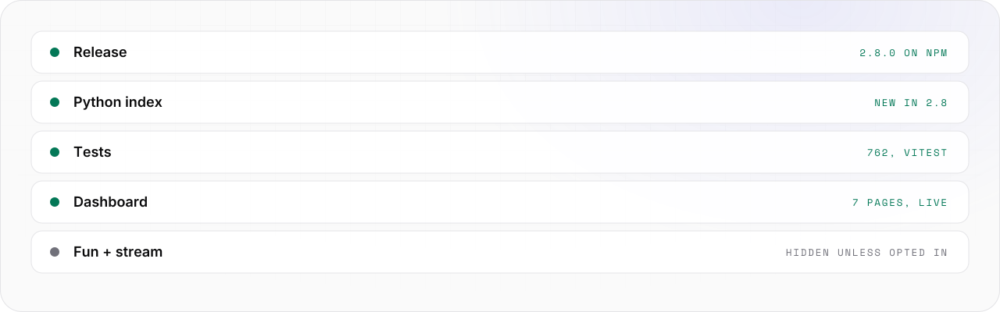
</picture>

- **Stable.** 2.8.0 on npm. The npm badge shows the live version.
- Tests: `npm test` (backend) · `npm run test:all` (backend + frontend).
- Changes: [`CHANGELOG.md`](CHANGELOG.md). Release highlights 2.0 to 2.8: [docs/REFERENCE.md](docs/REFERENCE.md#release-highlights).
- License: MIT.

<br>

```text
-- EOF ------------------------------------ CONTEXT LOADED. READ LESS. --
```

---

<sub>VM. studio / flagship · open source · look per <code>vm-brand</code> playbook</sub>
